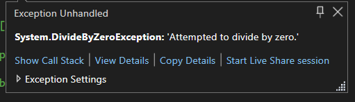
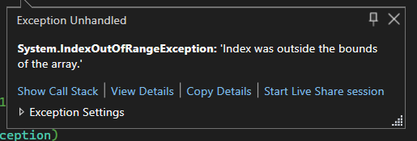

# Error Handling C#

## Task 1: Understanding and Using try/catch/finally blocks

1. Create a simple program that uses division operations.
2. Implement a try/catch/finally block to handle any DivideByZeroException that might occur.
3. In the catch block, print a meaningful error message.
4. In the finally block, print a statement indicating that the block has been executed. 

**Expected Outcome**: The program should correctly handle the DivideByZeroException and print the appropriate messages.

## Task 2: Catching and Throwing Different Types of Exceptions

1. Modify the program from Task 1 to include an array of integers.
2. Implement a second try/catch block to handle any IndexOutOfRangeException.
3. In the catch block, throw a new exception with a custom message.
4. Catch this new exception and print its message. 
**Expected Outcome**: The program should correctly catch and throw a new exception when an IndexOutOfRangeException occurs.

## Task 3. Defining and Using Custom Exception Classes

1. Define a new custom exception class called InvalidUserInputException.
2. Modify the program from Task 2 to include user input.
3. If the user enters an invalid input, throw an InvalidUserInputException.
4. Catch this exception and print its message. 
**Expected Outcome**: The program should correctly throw and catch the InvalidUserInputException.

## Task 4: Handling Global Unhandled Exceptions

1. Implement a method in the program from Task 3 that is unhandled.
2. Use the AppDomain's UnhandledException event to catch any unhandled exceptions globally.
3. Print a custom message when an unhandled exception is caught. 
**Expected Outcome**: The program should correctly catch and handle unhandled exceptions globally.

## Task 5: Using and global exception handler console application

1. Throw an exception in the program from Task 4 and catch it.
2. Print the exception's stack trace.
3. Write a brief interpretation of the stack trace. 
**Expected Outcome**: You should be able to understand and explain the information in the exception's stack trace.

# Documentation Report
## Description

**Task 1: Understanding and Using try/catch/finally blocks**

- Created a program with division operations, implemented try/catch/finally to handle DivideByZeroException, print error messages in the catch block, and indicate execution in the finally block.

- Try Catch wil try to execute the code in the try block, If the any exception is raised it will be handled by the 
catch block and print the exception message.

- Try and Catch block help in run the execution of the program without any break or crash the program. It will handled the exception carefully.

**Task 2: Catching and Throwing Different Types of Exceptions**

- Modify the Task 1 program with an integer array, add a try/catch block for IndexOutOfRangeException, print the error message in the catch block and ensure whether the finally block is executed.When user enter the index which is out of bounds.

- In this task, I have created the multiple catch block catch the specific exception when executing the program. like ZeroDivision or IndexOutOfBounds

- It will print the console messages accordingly to the exception that have raised from the try block. Finally block is to check is executing always after the try and catch block

**Task 3: Defining and Using Custom Exception Classes**

- Define a custom exception class called InvalidUserInputException, modify the Task 2 program to include user input, throw InvalidUserInputException for invalid input, and catch and print its message.

- I have created the custom exception InvalidUserInput by inherit the exception class, in the constructor part need to pass the message to the constructor of exception class.

- I have implemented user defined exception will throw exception when the user entered the invalid input.

**Task 4: Handling Global Unhandled Exceptions**

- Implement an unhandled method in the Task 3 program, use AppDomain's UnhandledException event to catch global unhandled exceptions, and print custom messages for them.

- I have created the event handler it will print the stack trace, message of exception and Event handler is subscribed to the AppDomain. When the exception is throw in the main method.

- AppDomain it will trigger the event handler to log the error before terminating the application. The exception is thrown to the OS. The Console Application will crash after print the error status.

**Task 5: Using and global exception handler console application**

- Throw an exception in the Task 4 program, catch it, print the exception's stack trace, and provide a brief interpretation of the stack trace.

- It is extend of the before the task, In the event handler added the functionality to print the error , stack trace, Application isTerminating.

- AppDomain will trigger the event handler, The event handler consists of the two parameter are object and UnhandledExceptionEventArgs. The Object will denote the sender who triggered the event and the UnhandledExceptionEventArgs it will contains the data to be transmitted.

## Explanation of Code:

In this code, it asks the user to enter the type of operations to be performed and to handle it using the try and catch block. The custom-type exception created by the inheritance of the exception class to the class The Appdomain helps in the use of the event handler before the exception is caught by the OS layer.

The handler logs the exception on the console. The switch case used to trigger the different types of exceptions When the user enters the invalid input, it will throw the UserInvalidInputException required by the number. 

## Understandings of Project

**ZeroDivisionError** 

I have used the try and catch block to handle the zero division error and checking the finally will be executed always. The ZeroDivision Exception will be thrown when the user enter the operand 2 as zero, by the try catch block is used to handle the error.

**IndexOutOfBounds** 

I have used the try and catch block to handle the index out of range and added the finally block in the try catch. To create the the index out of bounds in the for loop to iterate the array access the index where the size of the array is smaller than it.

## AppDomain

In C#, the concept of "AppDomain" refers to an isolated and secure boundary within a running application where code can be executed. Each AppDomain has its own set of assemblies and resources, which helps in achieving separation and isolation of different parts of an application. Here are some key points about AppDomains:

1. **Isolation**: AppDomains provide a way to isolate code within a single process. This means that if one AppDomain encounters an unhandled exception, it won't necessarily crash the entire application.

2. **Security**: You can set security policies and permissions for each AppDomain, which allows you to control what the code in that AppDomain is allowed to do.

3. **Unload ability**: You can unload an AppDomain without unloading the entire application domain. This is useful for scenarios where you want to load and unload assemblies dynamically.

4. **Assembly Versioning**: Each AppDomain can load different versions of the same assembly simultaneously, which can be useful when dealing with versioning issues.

5. **Application Isolation**: AppDomains are used extensively in scenarios like plugins, scripting engines, and application domains where you need to host untrusted code.

## Stack Trace

The execution stack keeps track of all the methods that are in execution at a given instant. A trace of the method calls is called a stack trace. The stack trace listing provides a way to follow the call stack to the line number in the method where the exception occurs.

The StackTrace property returns the frames of the call stack that originate at the location where the exception was thrown. You can obtain information about additional frames in the call stack by creating a new instance of the System.Diagnostics.StackTrace class and using its StackTrace.ToString method.

## Real-Time Problems

1. **Insufficient Logging and Monitoring**: Many projects lack proper error logging and monitoring. When errors occur, there's no detailed information available to diagnose and fix the issue promptly. This can result in prolonged downtime and customer dissatisfaction.

2. **Incomplete Error Handling**: Sometimes, developers handle only a subset of potential errors, leaving others unaddressed. This can lead to unexpected failures and security vulnerabilities when unhandled errors expose sensitive information or allow unauthorized access.

3. **Inadequate User Feedback**: When user-facing errors occur, users often receive cryptic error messages that provide little information about what went wrong. This can frustrate users and make it challenging for them to report issues effectively.

4. **Swallowing Exceptions**: In some cases, developers catch exceptions but do not handle them properly. Instead, they might log the error and continue execution, leading to unpredictable behavior and potentially corrupting data.

5. **Overly Generic Error Handling**: Using overly generic error messages, such as "An error occurred," makes it difficult to pinpoint the root cause of issues. Developers may struggle to troubleshoot problems, especially in complex systems.

6. **Resource Leaks**: Errors can sometimes result in resource leaks, such as unclosed database connections or file handles. These leaks can accumulate over time and degrade system performance.

7. **Security Vulnerabilities**: Inadequate error handling can expose security vulnerabilities, such as revealing sensitive information like database connection strings or stack traces to attackers.

8. **Lack of Fail-Safe Mechanisms**: Some projects do not implement fail-safe mechanisms or backup systems to handle errors gracefully, leading to total system failures when unexpected errors occur.

## Challenges Faced

1. To Create the Custom Exception to be thrown when the user selects the Exception.
2. Crete the ZeroDivision Error by assign the zero to the another variable to create the zero division error
3. To Call the Event Handler by the AppDomain when the exception in thrown.

## Conclusion

This program provides examples of different error handling techniques that developers can use in their own code. By understanding these techniques, developers can write more robust and reliable code that is less likely to fail due to errors. The program is well-documented and easy to follow, making it a useful resource for developers who are new to error handling or who want to improve their skills in this area.
