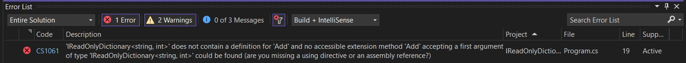

# Understanding and Practicing Collections and Generics in C#

## Introduction

C# provides a powerful and flexible framework for managing collections of objects. It also offers the concept of generics, which enhances type safety and reusability of code. This assignment aims to give you a comprehensive understanding of collections, their operations, and how generics can be applied in C#. Through practical coding tasks, you will learn how to use different types of collections, perform operations on them, and apply generics to improve code reusability and maintainability.

## Task 1: Working with Lists

Implement a program that uses a List to store a collection of book titles.

### 1.1 Create a List of strings, each representing a book title.

```csharp
List<string> bookDirectory = new List<string>();
```

### 1.2 Add five book titles to the list using the Add method.

```csharp
bookDirectory.Add("Book 1");
bookDirectory.Add("Book 2");
bookDirectory.Add("Book 3");
bookDirectory.Add("Book 4");
bookDirectory.Add("Book 5");
```

### 1.3 Remove a book from the list using the Remove method.

```csharp
bookDirectory.Remove("Book 3");
```

### 1.4 Use the Contains method to check if a particular book is in the list.

```csharp
bool containsBook = bookDirectory.Contains("Book 2");
```

### 1.5 Display all the books in the list.

```csharp
foreach (string book in bookDirectory)
{
    Console.WriteLine(book);
}
```

## Task 2: Using Stacks

Implement a program that uses a Stack to reverse a string.

### 2.1 Create a Stack of characters.

```csharp
Stack<char> StringReveserStack= new Stack<char>();
```

### 2.2 Push each character of a given string onto the stack.

```csharp
string inputString = "Hello";
foreach (char c in inputString)
{
    StringReveserStack.Push(c);
}
```

### 2.3 Pop each character off the stack and append it to a new string.

```csharp
string reversedString = string.Empty;
while (StringReveserStack.Count > 0)
{
    reversedString += StringReveserStack.Pop();
}
```

### 2.4 Display the original and reversed string.

```csharp
Console.WriteLine("Original String: " + inputString);
Console.WriteLine("Reversed String: " + reversedString);
```

## Task 3: Working with Queues

Implement a program that simulates a queue of people waiting in line.

### 3.1 Create a Queue of strings, each representing a person's name.

```csharp
Queue<string> TicketQueuLine = new Queue<string>();
```

### 3.2 Add five people to the queue using the Enqueue method.

```csharp
TicketQueuLine.Enqueue("Person 1");
TicketQueuLine.Enqueue("Person 2");
TicketQueuLine.Enqueue("Person 3");
TicketQueuLine.Enqueue("Person 4");
TicketQueuLine.Enqueue("Person 5");
```

### 3.3 Use the Dequeue method to remove a person from the queue.

```csharp
string personBeingServed = TicketQueuLine.Dequeue();
```

### 3.4 Display all the people in the queue.

```csharp
foreach (string person in TicketQueuLine)
{
    Console.WriteLine(person);
}
```

## Task 4: Understanding Dictionaries

Implement a program that maps a student's name to their grade.

### 4.1 Create a Dictionary with the key as a string (student's name) and the value as an integer (grade).

```csharp
Dictionary<string, int> StudentDirectory = new Dictionary<string, int>();
```

### 4.2 Add five students and their grades to the dictionary.

```csharp
StudentDirectory.Add("Student 1", 90);
StudentDirectory.Add("Student 2", 85);
StudentDirectory.Add("Student 3", 78);
StudentDirectory.Add("Student 4", 92);
StudentDirectory.Add("Student 5", 88);
```

### 4.3 Remove a student from the dictionary.

```csharp
StudentDirectory.Remove("Student 3");
```

### 4.4 Display all the students and their grades.

```csharp
foreach (var kvp in StudentDirectory)
{
    Console.WriteLine($"{kvp.Key}: {kvp.Value}");
}
```

## Task 5: Applying Generic Collections

Convert the previous tasks to use generic collections, if they aren't already. This should enhance type safety and allow for code reusability.

### 5.1 Update the book list to use `List<T>`.

### 5.2 Update the string reversal stack to use `Stack<T>`.

### 5.3 Update the queue of people to use `Queue<T>`.

### 5.4 Update the student grade dictionary to use `Dictionary<TKey, TValue>`.

## Expected Outcomes (Tasks 1-5)

For each task, the expected outcome is a C# program that successfully implements the specified collection and its operations. This program should be able to:

- Add and remove elements from the collection.
- Perform relevant operations such as checking if an element exists (for Lists and Dictionaries) or reversing a string (for Stacks).
- Display the elements in the collection.
- Implement generics to enhance type safety and allow for code reusability (Task 5).

## Task 6: Understanding IEnumerable, Concrete Types, and IReadOnlyDictionary

### 6.1 Implement a function named SumOfElements that accepts `IEnumerable<int>` as a parameter. This function should compute and return the sum of all integers in the collection. Test this function with different concrete collection types like List, Array, and Queue containing integers.

```csharp
int SumOfElements(IEnumerable<int> collection)
{
    int sum = 0;
    foreach (int item in collection)
    {
        sum += item;
    }
    return sum;
}
```

### Expected Outcome: You should be able to understand the reusability of the method SumOfElements just because we have used the `IEnumerable<int>`.

### 6.2 Understanding the ReadOnlyCollection helps

Implement a function named GenerateDictionary that creates a Dictionary object and returns it as an `IReadOnlyDictionary<string, int>`. This function should add a few key-value pairs to the dictionary before returning it.

```csharp
public static IReadOnlyDictionary<string, int> GenerateDictionary()
{
    Dictionary<string, int> studentRecord = new ();
    studentRecord.Add("Tom Cruise", 89);
    studentRecord.Add("Tim Hook", 78);
    studentRecord.Add("Lora Croft", 95);
    studentRecord.Add("Jenifer", 81);
    studentRecord.Add("Robert Downey jr", 99);
    IReadOnlyDictionary<string, int> studentRecordOriginal = studentRecord;
    return studentRecordOriginal;
}
```

Next, implement a function named PrintDictionary that accepts `IReadOnlyDictionary<string, int>` as a parameter. This function should print all the key-value pairs in the dictionary. Test this function by passing the return value of GenerateDictionary as input.

```csharp
public static void PrintDictionary(IReadOnlyDictionary<string, int> studentRecordOriginal)
{
    Console.WriteLine("Science Marks of the Student Directory is : ");
    ConsoleTable consoleTable = new ConsoleTable("Name", "Science Marks");
    foreach (var item in studentRecordOriginal)
    {
        consoleTable.AddRow(item.Key, item.Value);
    }
    consoleTable.Write();
}
```
When Try to modify the dictionary in the PrintDictionary method, you will get the following error.


### Expected Outcome: This task demonstrates how `IReadOnlyDictionary` can enforce immutability and how it can be used to protect the original data from being modified by the code that receives the dictionary.

## Testing
The Program Name was tested using unit tests to ensure correct implementation of the different collections and their operations. The following test cases were performed:

1. Task 1: Working with Lists
- Test adding a book title to the list
- Test removing a book title from the list
- Test checking if a book title is in the list
2. Task 2: Using Stacks
- Test reversing a string using a stack
3. Task 3: Working with Queues
- Test adding a person to the queue
- Test removing a person from the queue
4. Task 4: Understanding Dictionaries
- Test adding a student and their grade to the dictionary
- Test removing a student from the dictionary
5. Task 5: Applying Generic Collections
- Test using generic collections for each task
6. Task 6: Understanding IEnumerable, Concrete Types, and IReadOnlyDictionary
- Test computing the sum of elements in a collection
## Conclusion
The Project Name is useful for learning about collections and generics in C#. It provides a range of tasks that demonstrate the use of different types of collections and how generics can be applied to improve code reusability and maintainability. The program also includes unit tests to ensure correct implementation of each task.
