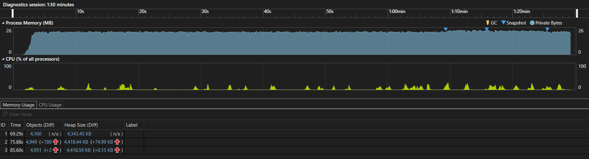

# Memory Optimization in C#: A Practical Assignment

## Introduction

In this assignment, we'll explore memory management in C#, a critical aspect of any high-
performance application- We'll learn how to detect, diagnose, and resolve memory issues in a C#
codebase. We'll also discuss best practices for memory management and use tools for memory
profiling.Upon completing this assignment, you'll have a deeper understanding of how to optimize
the performance of your C# applications by managing memory more effectively<br>

## Task 1: Detecting and Diagnosing Memory Issues

**Objective**: To identify and diagnose memory issues in a program.Code Snippet with Memory <br>
**Issue**: <br>

``` csharp
public class MemoryEater
{
    List<int[]> memAlloc = new List<int[]>();
    public void Allocate()
    {
        while (true)
        {
            memAlloc.Add(new int[1000]);
            // Assume memA110c variable is used only within this loop.
            Thread.Sleep(10);
        }
    }
}
class Program
{
    static void Main(string[] args)
    {
        MemoryEater me = new MemoryEater();
        me. Allocate();
    }
}
```

### Steps

1. Analyze the above code snippet. Can you identify the memory issue here?
2. Use a memory profiler tool to diagnose the problem in the code. You can use tools like
Visual Studio's built-in Diagnostic Tools <br>
**Expected Outcome**: Identification and diagnosis of the memory issue in the provided code snippet.

## Task 2: Implementing Memory Management Best

**Objective**: To fix the memory issue in the provided code snippet and implement memory management best practices.

### Steps

1. Based on your diagnosis, fix the memory issue in the provided code snippet.
2. Implement other best practices for memory management in C#. This might include practices such as (All the below point may not necessary apply to the given problem):

- Minimizing allocations in performance-critical code paths
- Using using statements or finally blocks to ensure resources are cleaned up properly
- Avoiding large object heap allocations when possible

**Expected Outcome:** The optimized code with memory management best practices implemented.

## Task 3: Memory Profiling

Objective: To understand and demonstrate the use of the memory profiling tool in VS for C#.

### Steps

1. Use the same memory profiler tool as in Task 2 (or choose another if you prefer) to profile the memory usage of the optimized code from Task 3.
2. Document the changes in memory usage before and alter your optimizations. Can you explain why these changes occurred based on your understanding of memory management in C#?<br>
**Expected Outcome**: A comparison of memory usage bef6re and after optimization. A clear understanding of how memory profiling tools in VS can help optimize code.

## Documentation Report

### Description

1. A code snippet with a memory issue is rectified by using the list in the local reference so that the list will be out of scope once the method is executed.
2. So that the memory will be freed up. Also, memory is freed up by using the clear method. The memory profiling is done using Visual Studio's built-in diagnostic tools. The memory usage is compared before and after the optimization.
3. The memory usage is reduced after the optimization. The memory profiling tools in VS can help optimize code by showing the memory usage of the code. So that we can optimize the code by reducing the memory usage.

### Original Code Analysis

The code you provided has a few issues:

1.Memory Leak:

The `MemoryEater` class contains an infinite loop in the `Allocate` method that continuously allocates memory by adding new integer arrays to the 'memAll0c' list. This will consume memory indefinitely and lead to a memory leak.

2.Lack of Resource Cleanup:

There's no mechanism to release or remove the allocated memory from the `memAll0c` list. Without cleanup, the program will consume more and more memory over time.

3.Performance Profiler of the Code:

The program continuously consumes memory by allocating the int array size of max value (10000) added to the list, and the garbage collector triggers less frequently to clear up the unused memory. The size of the heap also increases continuously.


To improve this code, add a way to limit the amount of memory allocated or provide a way to clean up allocated resources when they are no longer needed, and make the array out of bound by bringing the array creation inside the loop. We can able to persist the data
can move the list that contains the data to the database. We can access it in later use. By storing it in database it will take long time retrieve the data at a time. Be aware using the database storing only the necessary data or we can store it in the file system as text and we can assess it.

### Ways to Improve the Code

1. Method 1: Clear the memory when the OutOfMemoryException is thrown. It also consumes a lot of memory and only clears when the cache memory is fully occupied, and it suddenly de-allocates all the memory.

``` csharp
public class MemoryEater
{
    public void Allocate()
    {
        List<int[]> memAlloc = new List<int[]>();
        while (true)
        {
            try
            {
                memAlloc.Add(new int[1000]);
                // Assume memA110c variable is used only within this loop.
                Thread.Sleep(10);
            }
            catch(OutOfMemoryException)
            {
                memAlloc.Clear();
            }
        }
    }
}
class Program
{
    static void Main(string[] args)
    {
        MemoryEater me = new MemoryEater();
        me.Allocate();
    }
}
```

**Performance Profiler**:


2.Method 2: By creating the arrayList inside the while loop, it will go out of scope. So it will be automatically collected by the garbage collector. But it will reset the array list and add the integer array in each iteration. It will lead to the loss of the data.

```csharp
public class MemoryEater
{
    public void Allocate()
    {
        while (true)
        {
            List<int[]> memAlloc = new List<int[]>();
            memAlloc.Add(new int[1000]);
            // Assume memA110c variable is used only within this loop.
            Thread.Sleep(10);
        }
    }
}
class Program
{
    static void Main(string[] args)
    {
        MemoryEater me = new MemoryEater();
        me.Allocate();
    }
}
```

**Performance Profiler**:


3. Method 3: In order to avoid the large heap allocation By using the for loop inside the while loop, it will store the array in storage or clear it.

``` csharp

public class MemoryEater
{
    public void Allocate()
    {
        int maxArray = 1000;
        while (true)
        {
            List<int[]> memAlloc = new List<int[]>();
            try
            {
                for(int i = 0; i < maxArray; i++)
                {
                    memAlloc.Add(new int[1000]);
                    // Assume memA110c variable is used only within this loop.
                }
                Thread.Sleep(10);
            }
            catch(OutOfMemoryException)
            {
                memAlloc.Clear();
            }
        }
    }
}
class Program
{
    static void Main(string[] args)
    {
        MemoryEater me = new MemoryEater();
        me.Allocate();
    }
}
```

**Performance Profiler**:



### Real-time Problems

Here are some real-time problems that developers often encounter when working with code, along with brief explanations of each issue:

1. **Memory Fragmentation** : Continuous allocation and de-allocation will led to the memory fragmentation over the time. This can cause inefficient memory usage and memory degradation.

2. **Out of Memory Exception** : If memory is continuously allocated without proper bounds checking, It can results in Out of Memory Exception, Which can crash the application.
 
3. **Garbage Collection Overheads** : Frequent memory allocation can trigger the garbage collector to run more frequently. This can introduce pauses and impact the responsiveness of real-tie applications.

4.. **Heap Pressure** : Continuous allocation can put the pressure on the managed heap, which can lead to increased contention for memory allocation, causing delay in real-time processing.

5.. **Memory Leaks**: As mentioned earlier, memory leaks occur when a program allocates memory but doesn't release it properly. This can lead to increasing memory usage over time, slowing down or crashing the application.

6. **Concurrency Issues**: Multi-threading and parallel processing can introduce problems like race conditions, deadlocks, and thread synchronization issues. These issues can make programs behave unpredictably.

7. **Security Vulnerabilities**: Code may have security vulnerabilities like SQL injection, cross-site scripting (XSS), or improper input validation, which can lead to data breaches or unauthorized access.

8. **Performance Bottlenecks**: Identifying and optimizing performance bottlenecks in code can be challenging. Slow database queries, inefficient algorithms, or excessive network requests can degrade an application's performance.

9. **Compatibility**: Ensuring that code works correctly across different platforms, browsers, or devices can be tricky. Compatibility issues can lead to a poor user experience.

### Challenges Faced

1. The main challenge faced is to find the memory issue in the code by using the memory profiling tools.
2. The memory profiling tools in VS can help optimize code by showing the memory usage of the code. So that we can optimize the code by reducing the memory usage.
3. Explore how memory management works in C#.

### Takeaways

1. The memory profiling tools help in finding the memory usage of the code.

2. The memory management in C# is very important to optimize the code.
