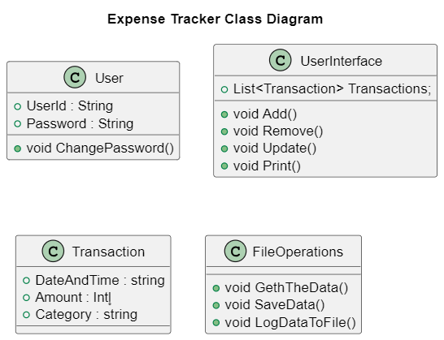

# Expense Tracker

## Task Overview

It is a console application to track the expense and income of the individual or company. The Expense tracker it keep the track of the all expenses and incomes by date accordingly. It performs the operation like calculate the total expense and income in between the first and last entries.

## Architecture Design Overview

1. Create the separate class for expense and income to store it in the structured way for easier access.

2. Create List of the Expenses and Income to store all the entries by the user.

3. To store the data in JSON file in order to avoid the data loss.

4. Add operation is carried out by the separate method to validation of the data entered by the user and store it in the list.

5. Update Operation is carried out by the same validation and ask the user to select the entity to be modified or delete the entire entry itself

6. Viewing the Expenses and income by using the table format and can be filtered by the date, category.

7. It will perform some operations like to calculate the total expenses, total income and balance amount.

8. Log the messages into the log file. Easier to debug later if any error occurred in future.

### UML Class Diagram

### UML Flow Diagram

## Validation Checks

- Validation done by the regex to determine whether the user input is correct.

- Fail Safe approach are applied to inorder avoid the termination of the program

- Try and Catch block are applied in the file handling in order to handle the file operation.

- Modularity is implemented by dividing the assign the each functionality to each method.

## Testing

- Testing is done for the invalid data entered by the user and checks it handles the data.

- To ensure the data persistance of the program data by checking the file data read and wrote properly

- Each Functionality is tested individually to ensure the operation are done properly.

## Real-Time UseCase

- It used to track the expense in to the day to day manner by user it will take automatically take date and time.

- It will automatically brings the entry recent entries or bring older entry by the date or category.