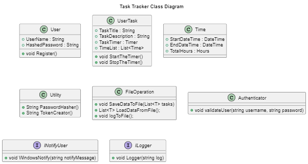
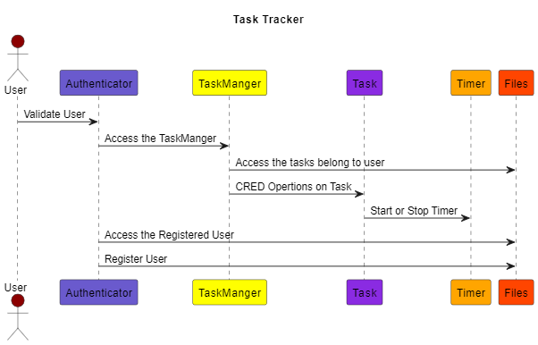
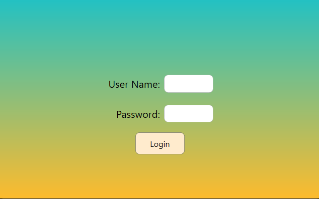
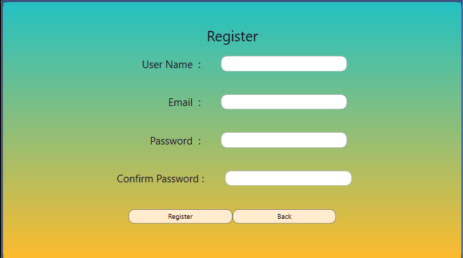

# Timer Tracker

## Contents

- [Introduction](#introduction)
- [Architecture](#architecture-blocks)
- [Design considerations](#design-consideration)
- [Design Flow Diagram](#design-flow-diagram)
- [MileStones](#milestones)
- [Future Scope](#future-scope)

## Introduction

Timer Tracker is a WPF application built on the.NET platform. The task tracker has a user authentication process where the user can login to the task tracker. The Timer Tracker has three functionalities: TaskList (CRED Operation), Filter Operation to filter the tasks, and Report, which consists of a detailed analysis of the tasks. The application was made to be interactive and easily accessible.

## Architecture Blocks

The architecture of the task tracker consists of the following classes for each functionality:

### Class Diagram

The class diagram will give an overview of the classes and interfaces that are associated with the task tracker.

### Class Description

#### User

- The user class consists of the username and hashed password. The login page asks for input for this user class.

- Passwords that are given by the user are hashed using the utility class that can perform the hash function.

- The user class defines the method register that creates the new user that can log in for the task tracker.

#### UserTask

- The UserTask class consists of details about the task that the validated user created. The UserTask can consist of the task title, description, timer, timeList, and List of Time class.

- Methods:

  - `Start Method` will run the timer for the current task.
  - `Stop Method` will stop the timer for the current task.

#### Time

- The Time class consists of the start date time, end date time, hours that have spent.

#### Utility

- Utility class that provide the functionality that used by the other classes.

- Methods:
  - The `PasswordHasher` method will hash the password using the SHA256 algorithm and return the hash value.
  - `TokenCreator` Method that was used to create the token for the user from their property. It is used to access the data of the individual user from the file.

#### Authenticator

- It used to authenticate the user with valid username and password to access the task tracker.

### Interface Description

- The Interface that can be implemented by the class that can able to perform the functionality.

- Later, Any further the functionality can be added by implementing the interface.

#### INotifier

- `INotifier` that used to raise the notification about the operations that are performed in the application.

#### ILogger

- `ILogger` used to add the functionality like logging to the file.

## Design Consideration

- Task Management: The task tracker should be able to manage tasks effectively. It should allow users to create, edit, and delete tasks. Users should also be able to assign tasks to other users and set deadlines for each task.

- User Management: The task tracker should have a user management system that allows users to create accounts, log in, and log out. It should also allow users to reset their passwords if they forget them.

- Task Status: The task tracker should have a status system that allows users to track the progress of each task. Users should be able to mark tasks as complete, in progress, or not started.

- Notifications: The task tracker should have a notification system that alerts users when a task is assigned to them, when a task is due, and when a task is completed.

- Reporting: The task tracker should have a reporting system that allows users to generate reports on tasks, users, and other metrics. Reports should be customizable and exportable.

## Design Flow Diagram

The design flow diagram consists of the flow that the user will experience throughout the application. The flow description is given below:

- The design flow will consist of the user, where the normal user will have the login page that is supported by the authenticator.

- Files will provide the necessary data from the files by using the json serialize method in json convert.

## UI Elements

This sample design includes UI elements for task trackers like the login and register pages.

- The login page will ask the user for a username and password.

- The registration page will have the username, email, password, and confirmation password.

- Buttons to perform the required actions or functionality

- This UI Element subjective to changeable. According to the requirements of the application.

## MileStones

- [] `CheckPoint 1` To built the UI for the login page, register pages, User data management and along unit testing for the user operations. UI For the task manager.

- [] `CheckPoint 2` Completion of the Task Manager UI along with the CRUD Operations of Task Manager. 

- [] `CheckPoint 3` Implement the timer functionality to the each task using the User Control Panel. Filter, and export data from the application

- [] `CheckPoint 4` Graphical representation of the task report and build the fully functional application and testing on the point end user.

## Future Scope

- Ability to integrate with the windows applications like calender.

- System level notification given to the user by the popup window.